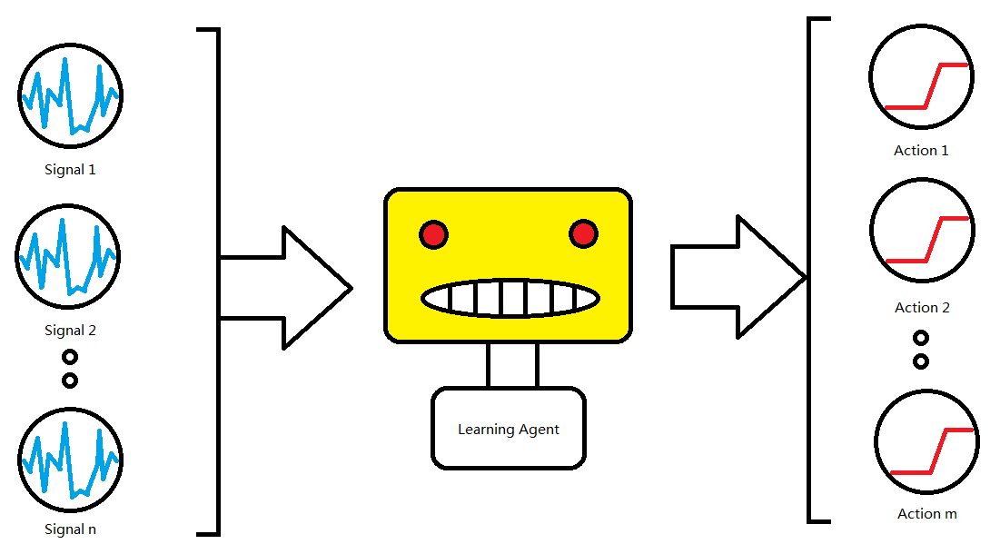

# Machine Learning Engineer Nanodegree

## Capstone Proposal
Louis Wan  
13th Jan, 2018

## Proposal

### Domain Background

Algorithmic trading begins in the early 1970s introduced by New York Stock exchange. Many traders and engineers develop technical indicators to identify the market status. After 10 years, algorithmic trading became widely used in trading S&P 500 equity and futures markets. As the development of electronic communication networks goes on and the US decreased the minimum tick size, Algo-trading was strongly encouraged. Till 2001, the concept of machine learning based trading agent is built by a team of IBM. [#1] IBM owns MGD and Hewlett-Packard owns ZIP. Both of the agents out-perform human traders.

The financial market is dynamic and full of uncertainty. Lots of financial industry like hedge funds have to works well with data, like time series data like the price of stocks and futures and multidimensional data like fundamental factors of a company. Investment bank hires many financial experts to building strategies for trading but people work emotionally. Algorithmic trading can help the expert to do judgment but the signals and indicators are all defined by a human. Algo-trading just provides a systematic way to trade according to a human logic. Can we build a reinforcement agent that can recognize signal by itself? This is the propose of this project.

### Problem Statement

Over hundreds of technical and statistical indicators are used for machine learning based trading agent. After training, the agent can turn the indicators into trading decisions(buy or sell with different amount). The agent at first will take data and theirs TAs as input. Then calculate the 'score' of each fund. It is considered as a classification problem. In the second part, we may directly correct the score to the nearest integer percentage(MPF must have an integer percentage i.e. the smallest unit is 1%) and assign it to the portfolio weight. We can also send the score to the reinforcement learning agent for training. RL agent can convert the score into trading actions.

### Datasets and Inputs

The project will use Sun Life Rainbow mandatory provident fund(MPF) Scheme for financial trading products. [#2] The reason why using Sun Life MPF is that of these funds include a different kind of global instrument such as bonds, stocks, and foreign exchanges. Less noise has to tackle with. Secondly, Sun Life MPF service charge is counted and reflected inside the product itself with little entry barrier. Usually, the bond trading is requiring 1.5M cash in security account which is not feasible for the majority of people. The twelve funds are provided by Sun Life MPF.

Sun Life Rainbow MPF Scheme 

#### Included for trading
1. Sun Life MPF Conservative Fund (Class B), Launch Date: 01 Dec 2000
2. Sun Life MPF Hong Kong Dollar Bond Fund (Class B), Launch Date: 01 Dec 2000
3. Sun Life MPF Stable Fund (Class B), Launch Date: 01 Dec 2000
4. Sun Life MPF Balanced Fund (Class B), Launch Date: 01 Dec 2000
5. Sun Life MPF Growth Fund (Class B), Launch Date: 01 Dec 2000
6. Sun Life MPF Hong Kong Equity Fund (Class B), Launch Date: 01 Dec 2000

#### Excluded from trading
7. Sun Life MPF Global Equity Fund (Class B), Launch Date: 01 Mar 2008
8. Sun Life MPF Asian Equity Fund (Class B), Launch Date: 01 Mar 2008
9. Sun Life MPF Greater China Equity Fund (Class B), Launch Date: 01 Mar 2008
10. Sun Life MPF Global Bond Fund (Class B), Launch Date: 01 Jan 2010
11. Sun Life MPF RMB and HKD Fund (Class B), Launch Date: 30 Jun 2012
12. Sun Life FTSE MPF Hong Kong Index Fund (Class B), Launch Date: 10 Dec 2013

Fund number 1 to 6 will be used for trading only due to the length of data of fund No. 7 to 12 is not enough. For technical indicators, I will use the python package named TA-lib for generating indicators. Since the only close price of the fund can be used, some of the indicators will not be available for use. I will use data from 01 Dec 2000 to 31 Dec 2017, total 6240 days. The data will be split into training and testing data in proportion 80/20. 

The training data is 4992 days(from 01 Dec 2000 to 02 Aug 2014) and the testing data is 1428 days(from 02 Aug 2014 to 31 Dec 2017). The financial data available in the world (index of the major market, fx rate, interest rate) will also include in the dataset. The data will grab from Yahoo! Finance. [#3]

### Solution Statement



As shown the graph above, the propose of the learning agent is to transform the financial product price, instrument price and their technical indicators into trading decisions but the what kind of machine learning algorithm to be used is still to be discussed. But we can define it as a classification and optimization problem. The following algorithm is suggested to use.

#### Supervised Learning Algorithm: [#4]
1. Logistic Regression
2. Multiple Layer Perceptron
3. Long-Short Term Memory [#5]
4. XGBoost [#6]

#### Unsupervised Learning Algorithm:
5. Principle Component Analysis (Dimensionality Reduction)
6. Clustering Algorithm

#### Reinforcement Learning Algorithm:
7. Q-Learning [#7]

### Benchmark Model and Evaluation Metrics
[#8]

We will use the CAR/MDD for assessing trend-trading algorithm. The higher the CAR/MDD mean the higher ratio of compound annual return(reward) to maximum drawdown(risk). The definition is stated below. You can find in the script 'car_mdd.py'

```python
import numpy as np
import pandas as pd
from datetime import datetime


def    car(_date, X):
    start = datetime.strptime(_date[0], '%d/%m/%Y')
    end = datetime.strptime(_date[-1], '%d/%m/%Y')
    delta = end - start
    delta_days = delta.days
    delta_years = float(delta_days) / 365
    print(delta_years)
    return_rate = (X[-1] - X[0])/X[0]
    return np.power(1 + return_rate, 1.0/delta_years) - 1


def max_drawdown(X):
    mdd = 0
    peak = X[0]
    for x in X:
        if x > peak: 
            peak = x
        dd = (peak - x) / peak
        if dd > mdd:
            mdd = dd
    return mdd 


if __name__ == '__main__':
    file_name = 'dataset/HK_Equity_Fund_B_testing.csv'
    df = pd.read_csv(file_name)
    date_list = df.Date.values.tolist()
    price_list = df.Price.values.tolist()
    _car = car(date_list, price_list) * 100
    _mdd = max_drawdown(price_list) * 100
    print('Compound Annuel Return = %.4f percent' % _car)
    print('Maximum DrawDown = %.4f percent' % _mdd)
    print('CAR/MDD = %.4f' % (_car/_mdd))
```

The fund with the best performance is Sun Life MPF Hong Kong Equity Fund (Class B) in the testing period
The compound annual return is 9.4378 percent and the maximum drawdown of the fund is 28.0587 percent. So, the CAR/MDD is 0.3364. If the learning agent has both high CAR/MDD and the CAR, that's means the learning agent is better than the benchmark.

### Project Design

Step 1: data collection and cleaning
Step 2: data pre-processing (PCA, transform)
Step 3: implementation of trading software
Step 4: implementation of machine learning models
Step 5: implementation of evaluation metrics
Step 6: implementation of optimization algorithm and cross-validation method
Step 7: try different model and feature engineering
Step 8: conclusion

### Citation

[#1 Agent-Human Interactions in the Continuous Double Auction by Rajarshi Das, James E. Hanson, Jeffrey O. Kephart and Gerald Tesauro](http://spider.sci.brooklyn.cuny.edu/~parsons/courses/840-spring-2005/notes/das.pdf)

[#2 Sun Life Rainbow mandatory provident fund(MPF) Scheme](https://www.sunlife.com.hk/HK/Investments/Pension+services+-+MPF+and+ORSO+Fund+Prices+and+Performance/Sun+Life+Rainbow+MPF+Price+&+Performance?vgnLocale=en_CA)

[#3 Yahoo! Finance](https://finance.yahoo.com/)

[#4 Pattern Recognition and Machine Learning, Authors: Bishop, Christopher]

[#5 Deep Learning, Authors: Ian Goodfellow and Yoshua Bengio and Aaron Courville](http://www.deeplearningbook.org/)

[#6 XGBoost](https://xgboost.readthedocs.io/en/latest/)

[#7 Reinforcement Learning: An Introduction, Authors: Richard S. Sutton and Andrew G. Barto](http://www.incompleteideas.net/book/bookdraft2017nov5.pdf)

[#8 Algorithmic Trading - Winning Strategies and Their Rationale, 1st Edition, Authors: Ernie Chan]